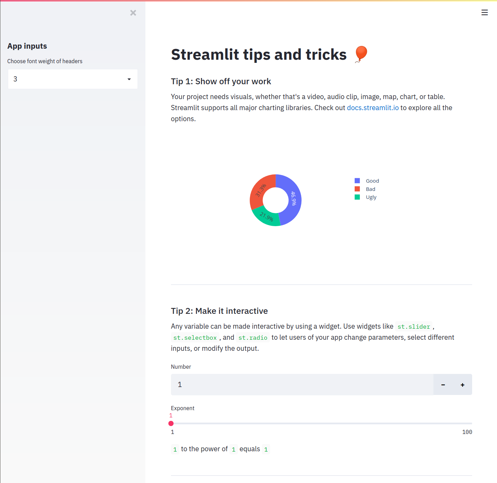

# Streamlit Tips
This project highlights some tips on how to best use Streamlit to create a beautiful and interactive data app.

## About Streamlit
Streamlit is an open-source app framework for data science. Rapidly build data apps in only a dozen lines of Python. Try it out! It only takes a minute to download and get started.

```
pip install streamlit
streamlit hello
```

To work with this example Streamlit app, run `streamlit run streamlit_tips.py` in your terminal. Streamlit will pop up in a tab in your default browser with an app that looks like the following:


